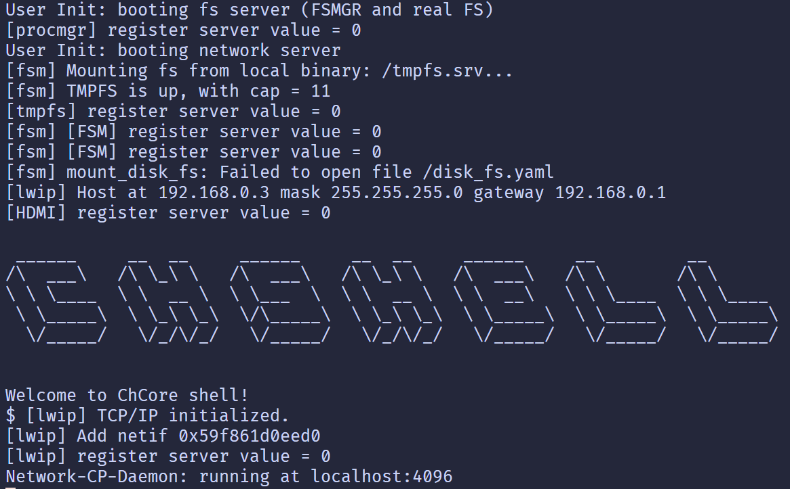

# Lab1 Report

## 启动 0 号核

**思考题 1**
`_start` 函数如何让其中一个核首先进入初始化流程，并让其他核暂停执行？

通过 `mpidr_el1` 读取核的序号，识别为 0 时进入 `primary` 标签，否则暂停执行

```x86asm
    mrs x8, mkidr_el1 
    and x8, x8, #0xFF
    cbz x8, primary /* 检测序号是否为 0 */

    ...
primary:
    ...
    b init_c /* 进入初始化流程 */
```

## 切换异常级别

根据提示完成即可。

**思考题 2**
进入 C 代码前不设置启动栈会发生什么？

C 函数编译后会首先将帧指针和返回地址压栈，若不设置 `sp` 会访问一个随机的内存地址，会产生无法预料的后果。

**思考题 3**
不清理 `.bss` 段在之后的何种情况下会导致内核无法工作？

初始化一个全局变量时，若未清理 `.bss` 段可能会导致该全局变量为一个随机值而不是默认的零值。

## 初始化串口输出

循环使用 `early_uart_send` 打印字符串中所有字符即可。

```c
void uart_send_string(char *str)
{
    for (int i = 0; str[i] != '\0'; i++) {
        early_uart_send(str[i]);
    }
}
```

## 启用 MMU

观察到 `A SAO SA nAA C I` 字段均已设置，只需要仿照格式设置 `M` 字段启用 MMU 即可。

```x86asm
    orr x8, x8, #SCTLR_EL1_M
```

## 页表映射

以 L2 级页表的填充为例，先观察低地址的映射

```c
u64 vaddr = PHYSMEM_START;

/* Normal memory: PHYSMEM_START ~ PERIPHERAL_BASE */
/* Map with 2M granularity */
for (; vaddr < PERIPHERAL_BASE; vaddr += SIZE_2M) {
        boot_ttbr0_l2[GET_L2_INDEX(vaddr)] =
                (vaddr) /* low mem, va = pa */
                | UXN /* Unprivileged execute never */
                | ACCESSED /* Set access flag */
                | NG /* Mark as not global */
                | INNER_SHARABLE /* Shareability */
                | NORMAL_MEMORY /* Normal memory */
                | IS_VALID;
}
```

给定一个虚拟地址 `vaddr`，通过 `GET_L2_INDEX` 获取物理地址对应的页表项位置，给对应的页表项填充物理地址的值，因为低地址中虚拟地址等于物理地址，所以

```c
boot_ttbr0_l2[GET_L2_INDEX(vaddr)] = (vaddr) | ...
```

在填充高地址时，物理地址对应的虚拟地址为物理地址加上一个固定偏移量 `vaddr = paddr + KERNEL_VADDR`，我们还需要修改循环的范围上限，也加上一个偏移量，并且使页表项的填充值为 `vaddr - KERNEL_VADDR`，最终得到

```c
u64 vaddr = KERNEL_VADDR + PHYSMEM_START;

for (; vaddr < KERNEL_VADDR + PERIPHERAL_BASE; vaddr += SIZE_2M) {
                boot_ttbr1_l2[GET_L2_INDEX(vaddr)] =
                        (vaddr - KERNEL_VADDR) /* low mem, va = pa */
                        | UXN /* Unprivileged execute never */
                        | ACCESSED /* Set access flag */
                        | NG /* Mark as not global */
                        | INNER_SHARABLE /* Shareability */
                        | NORMAL_MEMORY /* Normal memory */
                        | IS_VALID;
        }
```

其余几个部分的代码也可以通过相同的思路完成。

**思考题 4**
多级页表优劣？

- 优：当使用到的虚拟地址较为稀疏时，多级列表可以有效降低需要储存的页表大小，节省内存。
- 劣：当使用到的虚拟地址十分密集时，多级页表需要内存容量更大；多级页表的 MMU 十分复杂。

对于 4KB 粒度，共需 $2^{32} / 2^{12} = 2^{20}$ 个页，L3 表需要 $2^{20} / 2^9 = 2^{11}$ 个，L2 表需要 $2^{11} / 2^9 = 4$ 个，L1 和 L0 表各需要 $1$ 个，页表需要空间 $4(2^{11}+4+1+1)= 8216$ KB。

对于 2MB 粒度，共需 $2^{32} / 2^{21} = 2^{11}$ 个页，L2 表需要 $2^{12} / 2^9 = 4$ 个，L1 和 L0 表各需要 $1$ 个，页表需要空间 $4(4+1+1)=24$ KB。

**思考题 5**
实验内核需要的 L2，L1，L0 页表条目分别是多少？

需要的页数为 $(3\times 2^{28} + 15\times 2^{24}) / 2^{21} = 504$，L2 页表条目需要 504 个，L1 和 L0 都只要 1 个，共占 $3\times4=12$ KB。

**思考题 6**
为什么要为低地址配置页表？

在开启 MMU 前，内核在低地址上运行，此时 `pc` 的值为一个低地址，在开启后的一小段时间内，`pc` 的值仍然是低地址，此时由于低地址也配置了页表，因此低地址的 `pc` 能够正确被翻译到对的物理地址。后续再通过相应的跳转指令将 `pc` 的值设为高地址。若没有在低地址配置页表，开启 MMU 后的指令便会试图访问一个页表中不存在的地址，从而报错。

**思考题 7**
什么时候让暂停的核心继续执行？为什么一开始只让 0 号核心执行初始化流程？

在 0 号核心的 `init_c` 函数中，当 MMU 开启后会执行 `start_kernel(secondary_boot_flag)` 来设置这个 flag。随后在 `_start` 函数中，其他核心检测到 flag 改变就会跳转到 `seconday_init_c` 来继续执行。

只让 0 号核心执行初始化的原因：

- MMU 等功能的开启是全局性的，只需要一个核心便可以完成
- 多核运行容易导致数据竞争，通信开销等问题，会使得初始化流程更加复杂


